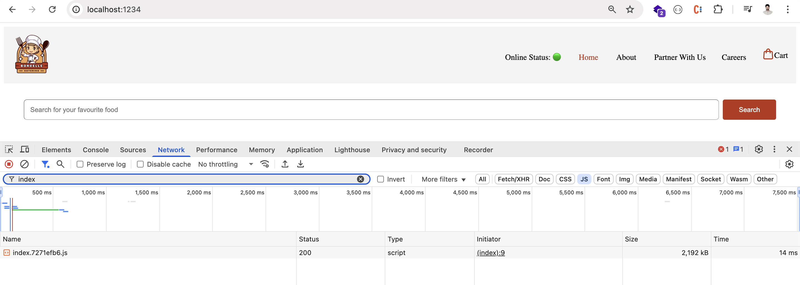
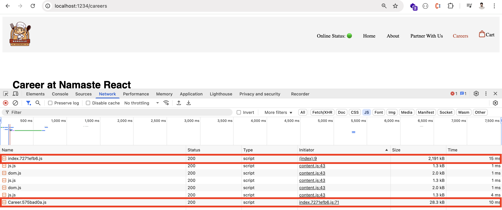

# React Component Types and Lifecycle

## 1. Functional Component
A **functional component** is a component that returns a piece of JSX code (a React element) and accepts `props` as arguments.

---

## 2. Class Based Component
A **class based component** is a component that extends `React.Component` and has a `render()` method that returns JSX.

---

## 3. Using `super(props)` in Class Components
When creating a class-based component by extending `React.Component`, you must call `super(props)` in the constructor to inherit the parent component's constructor logic.

**If you forget to use `super(props)`, you will get this error:**
> ReferenceError: Must call super constructor in derived class before accessing 'this' or returning from derived constructor

---

## 4. State Management
- In functional components, use the `useState` hook to store local data.
- In class-based components, use `this.state` to store local data.

---

## 5. React Component Lifecycle

React components go through a lifecycle with three main phases: **mounting**, **updating**, and **unmounting**. Each phase has associated lifecycle methods.

### Mounting
Occurs when a component is created and inserted into the DOM.

- `constructor()`: Initializes the component's state and binds methods.
- `static getDerivedStateFromProps()`: Updates state based on changes in props.
- `render()`: Returns the JSX to be rendered.
- `componentDidMount()`: Called after the component is rendered; often used for fetching data by calling API's or setting up subscriptions.

### Updating
Occurs when a component's state or props change, leading to re-rendering.

- `static getDerivedStateFromProps()`: Updates state based on props changes.
- `shouldComponentUpdate()`: Determines if the component should re-render (used for performance optimization).
- `render()`: Renders the updated JSX.
- `getSnapshotBeforeUpdate()`: Captures information from the DOM before it is updated.
- `componentDidUpdate()`: Called after the component is re-rendered; useful for performing actions based on updated state or props.

### Unmounting
Occurs when a component is removed from the DOM.

- `componentWillUnmount()`: Used for cleanup actions, such as clearing timers or canceling network requests.

### Error Handling
- `componentDidCatch()`: Called when there is an error during rendering, in a lifecycle method, or in the constructor of any child component. Used for logging errors and displaying fallback UI.

---

## 6. React Lifecycle Diagram


### Render Phase vs Commit Phase

**Render Phase:**
- This is when React calls the lifecycle methods and renders the JSX to create a virtual DOM.
- It is a "pure" phase: no side effects should occur here.
- Methods called: `constructor`, `getDerivedStateFromProps`, `render`, and `shouldComponentUpdate`.
- Can be paused, aborted, or restarted by React.

**Commit Phase:**
- This is when React applies changes to the actual DOM.
- Side effects are allowed here.
- Methods called: `componentDidMount`, `componentDidUpdate`, `componentWillUnmount`, and `getSnapshotBeforeUpdate`.
- This phase cannot be interrupted.

---

## 7. Code Example

```jsx
import React from "react";

class User extends React.Component {
    constructor(props) {
        super(props);
        console.log("User Constructor Method Called");
        // 1. It calls the contructer and
        // 2. It renders the dummy data on the DOM by rendering HTML.
        // 3. Then, the componentDidMount will be called.
    }

    componentDidMount() {
        console.log("User componentDidMount is Called");
        // 1. This method is used to call APIs.
        // 2. Once the data is received from the API, update the content using this.setState.
        // 3. This triggers a re-render of the component with the new data.
        // 4. Then, componentDidUpdate will be called.
    }

    componentDidUpdate() {
        console.log("User componentDidUpdate is Called");
    }

    componentWillUnmount() {
        // This will be called when we navigate away and the component is removed from the DOM.
        console.log("User componentWillUnmount is Called");
    }

    render() {
        console.log("User Render Method Called");

        return (
            <div>
                Name: Satya Teja DVS
            </div>
        );
    }
}
```

### Output in Developer Console Screen
When the component mounts:
```
User Constructor Method Called
User Render Method Called
User componentDidMount is Called
```

If the state or props update:
```
User Render Method Called
User componentDidUpdate is Called
```

When the component unmounts:
```
User componentWillUnmount is Called
```

---

## 8. Explanation of `componentWillUnmount` in Class-Based Components

If we define a `setInterval` inside `componentDidMount` in a class-based component, it will continuously call `console.log` even after navigating away from the component. This happens because the interval is not cleared when the component unmounts in a Single Page Application (SPA).

### ❌ Bad Practice

```jsx
componentDidMount() {
    setInterval(() => {
        console.log("Calling setInterval");
    }, 1000);
}
```
In the example above, console.log will continue to run even after navigating to a different page, because the interval remains active after the component has been unmounted.(If you are creating the mess, you should clear the mess)

### ✅ Good Practice
``` jsx
componentDidMount() {
    this.timer = setInterval(() => {
        console.log("Calling setInterval");
    }, 1000);
}

componentWillUnmount() {
    clearInterval(this.timer);
}
```
> Note: We stored setInterval in a variable using this.timer. "this" is available throught the class and we can create and access any variable using this.

---

## 9. Explanation of Component Unmounting in Functional Components

Similar to class-based components, when using functional components, any intervals or subscriptions created should be cleared when the component unmounts.

React is a Single Page Application (SPA), meaning components are mounted and unmounted dynamically as you navigate between pages. If intervals aren't properly cleared, they will continue to run even after the component is removed from the DOM.

Below is the bad code and it will call the console even when we change to the differnt method.

### ❌ Bad Practice

``` jsx
useEffect(() => {
    setInterval(() => {
        console.log("Calling setInterval");
    }, 1000);
}, []);
```
This code creates an interval that will continue to run indefinitely, even after the component is unmounted.

### ✅ Good Practice

``` jsx
useEffect(() => {
    const timer = setInterval(() => {
        console.log("Calling setInterval");
    }, 1000);

    return () => {
        clearInterval(timer);
    };
}, []);
```
> Note: The return statement in useEffect is used to clean up side effects, such as intervals or subscriptions, when the component is unmounted.

## 10. Single Responsibility Pricinciple

If we have defined the logic of fetching the restaurant data from an API inside the RestaurantMenu Component, the component is not maintaining the single resposibility princilple and the JOB of the the component is just to render the list of menus and it should worry of how to fetch the data.

So, we can extract the fetching API code to the seperate logic by creating the custom hook.

> ⚠️ Note: Hooks are nothing but the normal utility functions.

So, lets create a custom hook and the name of the hook should start with "use" for react to understand that it is a hook. The hook is just like a normal function where we can use useState and useEffect in it.

Below is the code for reference

### Main Component

```jsx
import useRestroData from "../utils/useRestroData";

const RestroDetailPage = () => {
  const {id} = useParams();

  // This is a custom hook that follows the Single Responsibility Principle (SRP)
  const restroData = useRestroData(id);

  if (restroData === null) {
    return <Shimmer />
  }

  return (
    // Return the JSX with the restroData on to the DOM
  )
}
```
### Custom Hook

> File Path: src/utils/useRestroData.js

```jsx
import { useEffect, useState } from "react";
import { RESTRO_DETAIL_PAGE_URL } from "./constants";

const useRestroData = (id) => {
  const [restroData, setRestroData] = useState(null);

  useEffect(() => {
    getRestaurantData();
  }, [])

  async function getRestaurantData() {
    const data = await fetch(`${RESTRO_DETAIL_PAGE_URL}&restaurantId=${id}`)
    const response = await data.json();
    setRestroData(response.data)
  }
  
  return restroData;
}
```

## 11. Lazy Loading the components

We've many names for this as some developers say
 1. Chuncking
 2. Code Splitting
 3. Lazy Loading

At the end all the components are compressed in a single js file which is heavy in case of large applications. So, we can divide the js files/chunck the js files by lazy loading the components.

### Normal Import

```jsx
import Career from './components/Career';
```

### Lazy Import

```jsx
const Career = lazy(() => import ('./components/Career'));
```

### File Size Before


### File Size After


### Notes and Conclusion

1. Using lazy loading (code splitting) can significantly improve the performance of large applications by reducing the initial JavaScript bundle size.
2. Even if the reduction in file size seems small (e.g., 1KB), the impact is much greater in large-scale projects with many components, leading to faster load times and a better user experience.
3. Lazy loading ensures that only the code required for the current view is loaded, deferring the loading of other components until they are actually needed.
4. This technique helps optimize resource usage, improves perceived performance, and is considered a best practice for scalable React applications.

## Suspense
Now that your component’s code loads on demand, you also need to specify what should be displayed while it is loading. You can do this by wrapping the lazy component or any of its parents into a <Suspense> boundary:

```jsx
<Suspense fallback={<h1>Loading....</h1>}>
  <h2>Preview</h2>
  <Career />
</Suspense>
```

## 12. CSS Libraries

There are many CSS Libraries available. Some of them are mentioned below. They have their own way of defining the styles. Choose on your own

## Some popular CSS frameworks
1. [Styled Components](https://styled-components.com/)
2. [Material UI](https://mui.com/material-ui/)
3. [Chakra UI](https://chakra-ui.com/)
4. [Ant Design](https://ant.design/)

## Most Recommended and Trending Library/Framework
🔊[Tailwind CSS](https://tailwindcss.com/)

### Criteria for Choosing CSS Frameworks
1. Project Requirement
2. Eases the learning process.
3. Minimizes compatibility issues.
4. Provides community support.
5. Ensures scalability & long-term viability.

## 13. Using Tailwind Framework
The Tailwind internally using POST CSS(which is a tool that uses JavaScript plugins to transform CSS code). Our Parcel understands the Tailwind CSS with the help of PostCSS tool.

✅ Please follow the Installation Guide to install using Parcel: https://tailwindcss.com/docs/installation/framework-guides/parcel

### Pros and Cons of Tailwind

| Pros | Cons |
|:-----|:-----|
| You can write all your styles directly in your component, so you don’t need to switch between CSS and JS files. This can make you more productive. Tailwind is easy to learn. | If you need a lot of styles, your className can get very long and messy, which can make your code harder to read. |
| Before all the classes will load at a time from the single CSS file and now, Our Bundler will only include the classes that are absolutely required for the component, making your website faster | |
|Tailwind will never ship unused CSS which improves the SEO Performance||
|Tailwind supports and has the classes for Dark and Light theme along with many other features||


## 14. Higher Order Functions
1. The higher order functions are the functions that takes the function/component as an input and returns the enhanced component/function as an output.
2. These higher order functions are the pure functions in which the function/component code will not be modified but it enhances the component while returning.
3. HOC is an advanced technique in React for reusing component logic

```jsx
const withLogger = (WrappedComponent) => {
  return (props) => {
    console.log("Component rendered:", WrappedComponent.name);
    return <WrappedComponent {...props} />;
  };
};

const MyComponent = (props) => {
  return <div>My Component</div>;
};

const EnhancedComponent = withLogger(MyComponent);
```